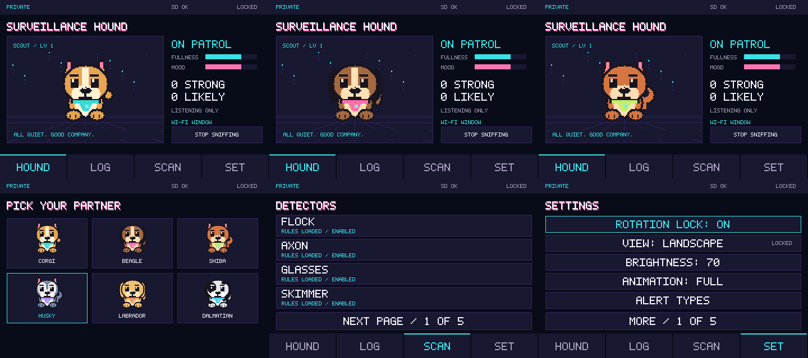

<!-- SPDX-License-Identifier: CC-BY-4.0 -->
# Surveillance Hound

An offline ESP32 radio-observation companion: six pixel dogs, passive Wi-Fi/Bluetooth clues and local logs. **0.1.0 development build.** A match describes radio evidence, not intent or proof of surveillance.



## Documentation

Read the [documentation](https://surveillancehound.dx.pe/) or [try the Hound in your browser](https://surveillancehound.dx.pe/lab/). The site uses **Zensical**, Hound's Midnight colors and original pixel art.

- [Try the Hound](docs/lab.md), [getting started](docs/getting-started.md) and [emulator guide](docs/simulator.md)
- [Controls](docs/controls.md), [hound care](docs/hound-care.md) and [appearance](docs/appearance.md)
- [Alerts and ignores](docs/alerts.md), [Travel Watch](docs/tag-watch.md) and [Follow Scent](docs/follow-scent.md)
- [Detection coverage](docs/DETECTIONS.md), [storage](docs/storage.md) and [privacy](docs/PRIVACY.md)
- [Build firmware](docs/BUILDING.md), [run tests](docs/testing.md) and [contribute](CONTRIBUTING.md)
- [Development status](docs/STATUS.md), [roadmap](docs/ROADMAP.md) and [release gates](docs/RELEASE.md)

Preview the complete documentation and browser lab locally (Docker supplies the pinned WebAssembly compiler):

```sh
python3 -m venv .venv-docs
. .venv-docs/bin/activate
python -m pip install -r requirements-docs.txt
python tools/build_web.py --docker
zensical serve
```

Open <http://127.0.0.1:8000/>. See [documentation development](docs/documentation.md) for the strict build and GitHub workflow.

## Try the emulator

Requires Python 3.11+, CMake 3.22+, Ninja, a C++20 compiler and OpenSSL development headers.

```sh
python3 -m venv .venv
. .venv/bin/activate
python -m pip install -r requirements-dev.txt
python3 tools/run_local.py
```

Open <http://127.0.0.1:8765/>. It runs the firmware UI with synthetic events and RAM-only progress. It does not capture USB radio data or write SD logs.

## Hardware

The display target is the LCDWiki E32R40T / tested Hosyond 4-inch ESP32 board with ST7796 display and XPT2046 touch. Firmware uses **ESP-IDF 6.0.2**, pinned to `7101770dc6db2667b3c477cc31365dd1acd6db4e`.

After activating the pinned SDK in a checkout without spaces:

```sh
idf.py build
./tools/flash.sh /dev/ttyUSB0
```

See [Building](docs/BUILDING.md) and [getting started](docs/getting-started.md) before flashing. An ESP32-C3 has a separate [radio-only harness](docs/C3_RADIO_TEST.md).

## Status and scope

67 rules cover 19 categories. Hound listens for selected 2.4 GHz Wi-Fi management frames and legacy BLE advertisements; it does not associate, probe, advertise, inject or upload. Quiet scans are not an all-clear, and Travel Watch detects repeated nearby presence without proving movement.

Initial display/SD checks and host regressions are documented. Controlled RF accuracy, durability/power tests, formal soak and release/license acceptance remain open. The [status page](docs/STATUS.md) is the current summary; dated records preserve earlier evidence.

## License

Copyright 2026 Jascha Wanger ([https://dx.pe](https://dx.pe)).

Firmware, tools and tests: Apache-2.0. Original docs/art: CC-BY-4.0. Independently assembled signature facts: CC0-1.0, with separate source terms. See [LICENSE](LICENSE), [NOTICE](NOTICE), [dependency ledger](THIRD_PARTY_LICENSES.md) and [provenance](data/provenance.yaml).
